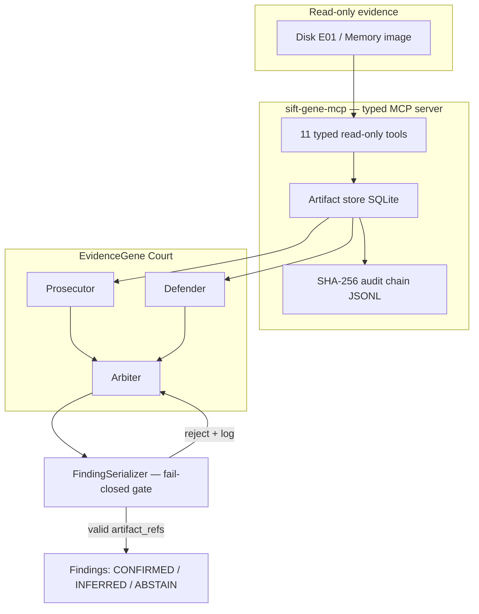

# EvidenceGene Court

> **Adversarial autonomous DFIR.** A court of AI agents — Prosecutor, Defender,
> Arbiter — investigates disk and memory evidence through a typed, read-only
> MCP server. No finding can reach the report without a valid artifact
> reference in a SHA-256-chained audit log. Hallucinations are not discouraged
> by prompts — they are **structurally rejected at the API boundary**.

Built for [FIND EVIL!](https://findevil.devpost.com/) (SANS Institute, 2026) —
the first hackathon for autonomous AI incident response on the
[SIFT Workstation](https://www.sans.org/tools/sift-workstation).

## Why this exists

GTG-1002 showed attackers running MCP-orchestrated intrusions at 80–90%
autonomy. EvidenceGene Court is the mirror image on defense: the same
agent-plus-MCP shape, but with the trust boundary inverted — every tool is
read-only, every output is content-addressed, and every claim is audited.

The full investigation runs **on a single laptop with a local LLM**
(LM Studio / any OpenAI-compatible endpoint). Evidence containing PII or
privileged material never leaves the machine. The same configuration flag
points the court at a cloud API if your policy allows it.

## Architecture (pattern: Custom MCP Server + Multi-Agent)



Security boundaries — all **architectural**, none prompt-based:

| Boundary | Enforcement |
|----------|-------------|
| No shell, no writes | Tools do not exist on the wire; spoliation impossible |
| Context-window safety | Tools return bounded previews + `artifact_id`; full data stays in SQLite |
| Anti-hallucination | Serializer rejects findings whose `artifact_refs` are missing/unknown |
| Tier integrity | CONFIRMED granted only for refs spanning >=2 distinct evidence sources |
| Runaway loops | Hard `max_iterations` cap in the court orchestrator |
| Tamper evidence | Append-only JSONL with SHA-256 hash chain; `verify_audit_chain` replay |

## Quick start

```bash
# prerequisites: uv, sleuthkit (brew install sleuthkit libewf), python 3.12+
uv sync --extra dev --extra forensics

# health check (LLM endpoint + forensic tools)
uv run egc-court health

# run the MCP server standalone (stdio)
uv run egc-mcp

# run a full court investigation against a case
uv run egc-court investigate --memory /cases/case001/citadeldc01.mem --source memory:dc01
```

Configuration via `.env` (see `.env.example`) — `EGC_LLM_BASE_URL` defaults to
LM Studio at `http://localhost:1234/v1`.

## On the SIFT Workstation (for judges)

All tools used (Volatility 3, Sleuth Kit) ship with SIFT. See
[docs/TRY_IT_OUT.md](docs/TRY_IT_OUT.md) for step-by-step instructions.

## Dataset

Demo case: [DFIR Madness Case 001 — The Stolen Szechuan Sauce](https://dfirmadness.com/the-stolen-szechuan-sauce/)
(public, with published ground truth). See [docs/DATASET.md](docs/DATASET.md).

## License

MIT — see [LICENSE](LICENSE).
