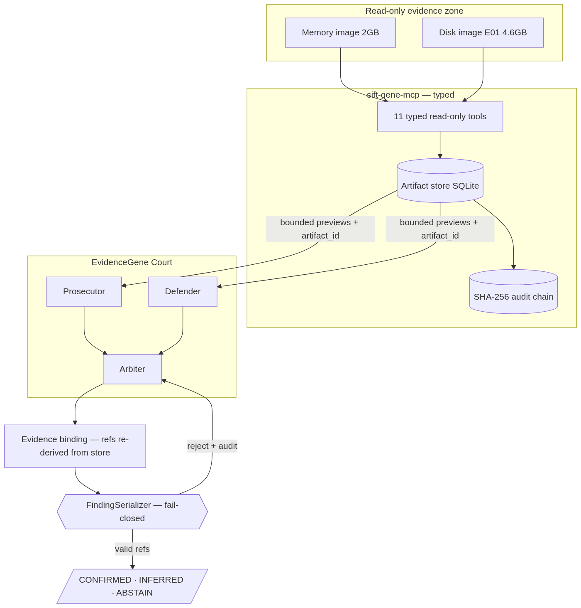
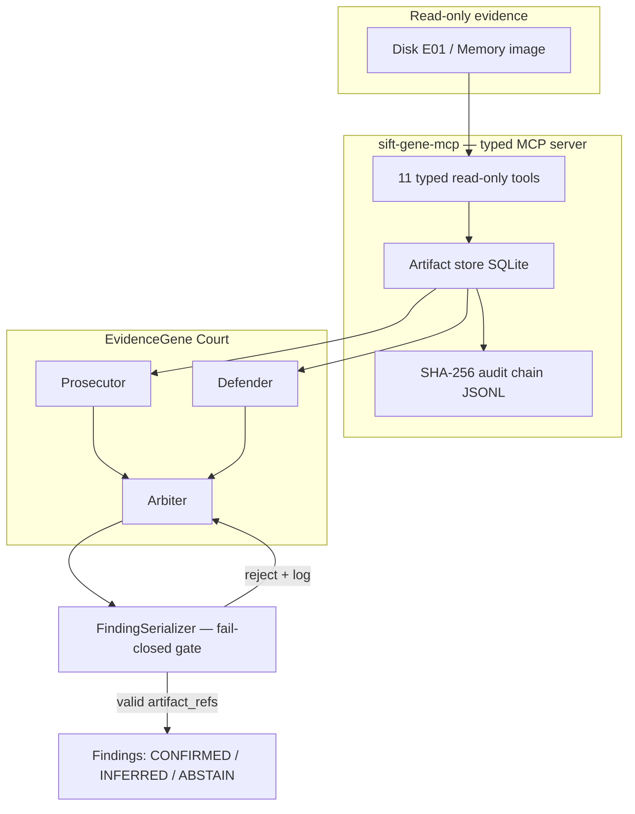

# EvidenceGene Court

[](https://github.com/FUYOH666/evidencegene-court/actions/workflows/ci.yml)
[](LICENSE)
[](https://www.python.org/downloads/)
[](https://github.com/astral-sh/uv)
[](https://modelcontextprotocol.io/)
[](tests/test_attestation.py)
[](https://findevil.devpost.com/)

> **Adversarial autonomous DFIR.** A court of AI agents — Prosecutor, Defender,
> Arbiter — investigates disk and memory evidence through a typed, read-only
> MCP server. No finding can reach the report without a valid artifact
> reference in a SHA-256-chained audit log. Hallucinations are not discouraged
> by prompts — they are **structurally rejected at the API boundary**.

Built for [FIND EVIL!](https://findevil.devpost.com/) (SANS Institute, 2026) —
the first hackathon for autonomous AI incident response on the
[SIFT Workstation](https://www.sans.org/tools/sift-workstation).

**Demo video:** [youtu.be/HerCqv_LA3Q](https://youtu.be/HerCqv_LA3Q) ·
**Pattern:** Custom MCP Server + Multi-Agent · **Runs fully local** (no cloud)



On [DFIR Madness Case 001](https://dfirmadness.com/the-stolen-szechuan-sauce/)
the court autonomously identified the documented implant `coreupdater.exe` and
its C2 connection, promoted it to `CONFIRMED` by corroborating memory against
the disk timeline, and blocked an injected fabricated finding — all on a laptop
with a local model. See the [accuracy report](docs/ACCURACY_REPORT.md).

## Why this exists

GTG-1002 showed attackers running MCP-orchestrated intrusions at 80–90%
autonomy. EvidenceGene Court is the mirror image on defense: the same
agent-plus-MCP shape, but with the trust boundary inverted — every tool is
read-only, every output is content-addressed, and every claim is audited.

The full investigation runs **on a single laptop with a local LLM**
(LM Studio / any OpenAI-compatible endpoint). Evidence containing PII or
privileged material never leaves the machine. The same configuration flag
points the court at a cloud API if your policy allows it.

## Architecture (pattern: Custom MCP Server + Multi-Agent)



Security boundaries — all **architectural**, none prompt-based:

| Boundary | Enforcement |
|----------|-------------|
| No shell, no writes | Tools do not exist on the wire; spoliation impossible |
| Context-window safety | Tools return bounded previews + `artifact_id`; full data stays in SQLite |
| Anti-hallucination | Serializer rejects findings whose `artifact_refs` are missing/unknown |
| Tier integrity | CONFIRMED granted only for refs spanning >=2 distinct evidence sources |
| Runaway loops | Hard `max_iterations` cap in the court orchestrator |
| Tamper evidence | Append-only JSONL with SHA-256 hash chain; `verify_audit_chain` replay |

## v0.2 — Red-team, Ablation, Jury

Three additions push past "typed MCP + anti-hallucination" (now table stakes):

- **Injection Harness (`egc-court redteam`)** — the GTG-1002 mirror. Autonomously
  attacks our own defender with 6 payloads mapped to MITRE ATLAS, and proves each
  is neutralized architecturally (latest: 6/6 defended). Directly answers the
  judging criterion "are guardrails architectural or prompt-based — tested for
  bypass?". See [docs/ATLAS_MAPPING.md](docs/ATLAS_MAPPING.md).
- **Counterfactual Ablation (`egc-court ablate`)** — remove one evidence source
  and watch CONFIRMED collapse to INFERRED. Findings are falsifiable; the tier is
  earned by the evidence, not asserted by the model.
- **Jury of Models (`egc-court jury`)** — collect evidence once, run the court per
  juror model, promote only cross-model consensus. Resilient: a juror that errors
  abstains instead of crashing the panel.

Plus an ATT&CK kill-chain timeline and a self-contained HTML report
(`egc-court report`). Everything new is deterministic and offline-testable; only
the jury spends (local) LLM calls. A synthetic mini-fixture (`egc-court fixture`)
runs the whole pipeline in milliseconds without evidence images.

## Quick start

```bash
# prerequisites: uv, sleuthkit (brew install sleuthkit libewf), python 3.12+
uv sync --extra dev --extra forensics

# health check (LLM endpoint + forensic tools)
uv run egc-court health

# run the MCP server standalone (stdio)
uv run egc-mcp

# run a full court investigation against a case
uv run egc-court investigate --memory /cases/case001/citadeldc01.mem --source memory:dc01
```

Configuration via `.env` (see `.env.example`) — `EGC_LLM_BASE_URL` defaults to
LM Studio at `http://localhost:1234/v1`.

## On the SIFT Workstation (for judges)

All tools used (Volatility 3, Sleuth Kit) ship with SIFT. See
[docs/TRY_IT_OUT.md](docs/TRY_IT_OUT.md) for step-by-step instructions.

## Dataset

Demo case: [DFIR Madness Case 001 — The Stolen Szechuan Sauce](https://dfirmadness.com/the-stolen-szechuan-sauce/)
(public, with published ground truth). See [docs/DATASET.md](docs/DATASET.md).

## Project layout

| Path | What |
|------|------|
| `src/evidencegene/tools/` | Typed read-only MCP server + forensic wrappers |
| `src/evidencegene/court/` | Prosecutor/Defender/Arbiter orchestrator + LLM client |
| `src/evidencegene/attestation/` | FindingSerializer + tiers (the fail-closed gate) |
| `src/evidencegene/artifacts/` | Artifact store + SHA-256 audit chain |
| `docs/` | Architecture, dataset, accuracy report, try-it-out |
| `docs/submission/` | Demo video, diagram, real sample-run logs |

## Documentation

- [Architecture & trust boundaries](docs/ARCHITECTURE.md)
- [Accuracy report](docs/ACCURACY_REPORT.md)
- [Dataset](docs/DATASET.md) · [Try it out](docs/TRY_IT_OUT.md)
- [Contributing](CONTRIBUTING.md) · [Security policy](SECURITY.md) · [Changelog](CHANGELOG.md)

## License

MIT — see [LICENSE](LICENSE). Built by [Aleksandr Mordvinov](https://github.com/FUYOH666).
Open source so the DFIR community can build on it.
