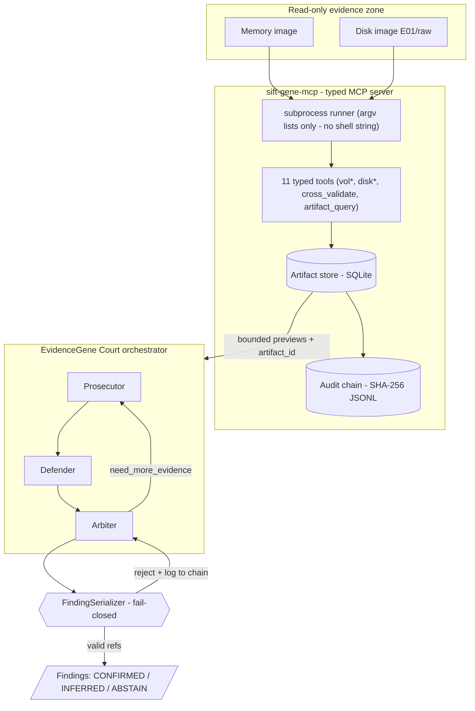

# Architecture

**Pattern:** Custom MCP Server (#2) + Multi-Agent Framework (#3), combined.
The platform choice matters less than where the trust boundaries sit — so this
document is organized around boundaries, and marks each as **architectural**
(enforced by the shape of the system) or **prompt-based** (enforced by asking
the model nicely). EvidenceGene Court has exactly one prompt-based control, and
it is backed by an architectural one.

## Components

## Trust boundaries

| # | Boundary | Type | Mechanism | Bypass test |
|---|----------|------|-----------|-------------|
| 1 | No arbitrary commands | Architectural | No `execute_shell` tool exists on the MCP wire; runner takes `argv` lists built by typed functions | A prompt-injected "run rm -rf" has no tool to call → `ToolNotFound` |
| 2 | No evidence modification | Architectural | No write/delete tool exists; images opened read-only by vol/TSK | Documented in accuracy report |
| 3 | Context-window safety | Architectural | Tools return <=`preview_rows` rows + `artifact_id`; full output stays in SQLite, paged via `artifact_query` | A 5000-row timeline never enters the prompt |
| 4 | Anti-hallucination | Architectural | `FindingSerializer` rejects any finding whose `artifact_refs` are empty or not present in the store | `test_finding_without_refs_is_rejected`, `test_finding_with_unknown_ref_is_rejected` |
| 5 | Tier integrity | Architectural | CONFIRMED granted only when refs span >=2 distinct evidence sources; otherwise auto-downgraded to INFERRED | `test_single_source_cannot_reach_confirmed` |
| 6 | Runaway-loop safety | Architectural | Hard `max_iterations` cap in the orchestrator | Court always terminates |
| 7 | Tamper evidence | Architectural | Append-only JSONL, each entry hashes the previous; `verify_audit_chain` replays | `test_audit_chain_detects_tampering` |
| 8 | "Cite real artifacts" | Prompt-based | Agents are told to cite `artifact_id`s | Backed by boundary #4 — if the model ignores the prompt, the serializer still rejects the finding |

The key design claim: **boundary #8 (prompt) is never load-bearing on its own.**
If the model hallucinates a citation, boundary #4 catches it. If it invents an
`artifact_id`, the store lookup fails. The guardrail does not depend on model
compliance.

## Why adversarial (not a single self-correcting loop)

A lone agent that critiques itself shares the same blind spots and tends toward
confidence-laundering — smoothing over contradictions to reach a clean
conclusion. Splitting the work into a Prosecutor (find evil) and a hostile
Defender (explain it away) forces contradictions into the open; the Arbiter can
only resolve them by requesting more evidence or abstaining. ABSTAIN is a
first-class outcome, not a failure.

## v0.2 adversarial layers

- **Injection Harness (red-team).** Mirrors GTG-1002 by attacking our own
  defender. Each payload maps to a MITRE ATLAS technique and targets a specific
  boundary above; the harness asserts the boundary holds and logs a
  `redteam_attempt` to the audit chain. This makes "tested for bypass" a
  reproducible artifact, not a claim. See [ATLAS_MAPPING.md](ATLAS_MAPPING.md).
- **Counterfactual ablation.** Re-runs evidence binding with one source hidden
  (`ArtifactStore.artifacts_containing(exclude_sources=...)`). If a CONFIRMED
  finding does not collapse, the tier was over-granted — a self-check on
  boundary #5.
- **Jury of models.** Evidence is collected once (deterministic); the LLM court
  runs per juror via `Court.trial(model=...)`. Consensus is computed from
  per-juror entity votes. A juror that raises `LLMError` abstains, so the panel
  degrades gracefully (bounded by the same architectural guarantees — a juror
  cannot publish an unbacked finding either).

## Reproducibility

The orchestrator calls the same typed functions the MCP server exposes, so a CLI
run and an MCP-client run produce identical artifacts and audit chains. Every
finding traces back to a tool execution by `artifact_id`; every tool execution
is in the chain with arguments, row count, and output hash.
